# telegram-bot-listener-mode

**Goal:** Support running the Telegram listener as a Bot (default) or as a Userbot (legacy), selected by env config.
**Status:** done
**Created:** 2026-05-09
**Execution:** Use `/execute-plan <path-to-this-file>` to run this plan task-by-task.

---

## Architecture

Pyrofork's `Client` natively supports bot mode via the `bot_token=` kwarg — same MTProto client, different auth. We add a new optional `TG_BOT_TOKEN` env var; when set, `main.py` constructs the `Client` in bot mode (no session string, no `.session` file). Otherwise, we fall back to the existing userbot path (session string → in-memory; else interactive `.session`). Bot mode is the documented default in `.env.example` and README — userbot becomes the opt-in legacy path for cases where the operator can't add a bot as admin of the source channel.

Mode-selection precedence in `main.py`:
1. `TG_BOT_TOKEN` set → **bot mode** (preferred). Logs a warning and ignores `TG_SESSION_STRING` if both are set.
2. `TG_SESSION_STRING` set → userbot in-memory mode.
3. Neither set → userbot interactive `.session` mode (local dev).

Caveats called out in the README:
- A Telegram bot only receives `channel_post` updates from a channel where it is **added as an admin**. Operators using bot mode must add the bot to the source channel as admin with at least "Post Messages" / read access.
- Bot accounts have stricter media-download limits than userbots (Telegram caps bots at 20 MB per file via Bot API; pyrofork uses MTProto so this is usually fine, but very large videos may fail). This is a known trade-off, not a blocker.
- `MessageHandler` in pyrogram dispatches both regular messages and channel posts through the same callback, so `tg_listener.py` needs no logic change beyond confirming the chat-id filter still matches `channel_post` updates (it does — pyrogram normalizes both into `Message` with `chat.id`).

---

## Phase 1 — Config + auth wiring

### Task 1: Add `tg_bot_token` config field

**Files:**
- Modify: `src/config.py`
- Test: `tests/test_config.py`

- [x] Write failing test: `test_tg_bot_token_optional` — `Config()` loads with `TG_BOT_TOKEN` set and exposes it as `cfg.tg_bot_token`; another test asserts default is `None` when env is unset.
- [x] Run test — expect FAIL
- [x] Add `tg_bot_token: str | None = Field(default=None, ...)` to `Config`
- [x] Run test — expect PASS
- [x] Commit: `git commit -m "feat(config): add optional TG_BOT_TOKEN for bot listener mode"`

### Task 2: Wire bot-vs-userbot selection in `main.py`

**Files:**
- Modify: `src/main.py`
- Test: `tests/test_main_client_factory.py` (new) — extract a small `build_tg_client(config)` helper to keep `main()` testable.

- [x] Write failing tests in `tests/test_main_client_factory.py`:
  - bot mode: when `tg_bot_token` is set, returned Client kwargs include `bot_token`, no `session_string`, no `in_memory=True` *unless* we choose to keep bot client in-memory too (decision: yes — bots have no use for an on-disk session). Assert `in_memory=True`.
  - userbot string mode: when `tg_session_string` is set and `tg_bot_token` is unset, kwargs include `session_string` and `in_memory=True`.
  - userbot file mode: when both unset, kwargs include `name` only (no `bot_token`, no `session_string`).
  - precedence: when both `tg_bot_token` and `tg_session_string` are set, bot wins and a warning is logged.
- [x] Run tests — expect FAIL
- [x] Extract `build_tg_client(config) -> Client` (or `build_tg_client_kwargs(config) -> dict` for easier asserts) into `src/main.py`. Implement precedence above. Use `caplog` for the warning assertion.
- [x] Run tests — expect PASS
- [x] Manually run `make lint typecheck` to keep type-ignores localized.
- [x] Commit: `git commit -m "feat(main): select pyrofork bot or userbot mode from config"`

---

## Phase 2 — Listener compatibility check

### Task 3: Confirm `TgListener` works for bot-delivered `channel_post`

**Files:**
- Modify: `src/tg_listener.py` (likely no code change; defensive only)
- Test: `tests/test_tg_listener.py`

- [x] Write failing test: `test_resolve_source_works_with_bot_get_chat_returning_channel` — drive `resolve_source()` against a mock client where `get_chat("@channel")` returns a `FakeChat(id=-100…)` (same shape bots return). Then a `test_on_message_forwards_channel_post` that constructs a `MagicMock` with `chat.id` set to the resolved id and `media_group_id=None` and asserts the debouncer receives it. (Existing tests already cover most of this — only add what's missing.) **Skipped — existing `test_resolve_source_calls_get_chat_for_username` and `test_on_message_forwards_to_debouncer` already exercise both paths with mocks that are mode-agnostic.**
- [x] Run tests — expect FAIL (or skip if redundant; if existing tests already cover both, mark this task `[~]` skipped with a note in **Decisions Made**)
- [x] Implement minimal change if any (likely none). **None needed — pyrogram MessageHandler dispatches both `message` and `channel_post` updates through the same callback.**
- [x] Run tests — expect PASS
- [x] Commit (only if code changed): `git commit -m "test(listener): cover bot-mode channel_post dispatch path"` **Skipped, no code change.**

### Task 4: Smoke-check `make check`

**Files:** none (verification only)

- [x] Run `make check` — `lint + typecheck + test` must all pass.
- [x] If any pyright warnings appear around the new `bot_token` kwarg, add a localized `# type: ignore[arg-type]` and document why in **Decisions Made**. **None — existing `# type: ignore[arg-type]` on `Client(**...)` already covers it.**
- [x] No commit unless a fix landed; in that case: `git commit -m "fix(main): silence pyright on pyrofork bot kwargs"` **No fix needed.**

---

## Phase 3 — Documentation + ops

### Task 5: Update `.env.example`, `README.md`, `CLAUDE.md`

**Files:**
- Modify: `.env.example`
- Modify: `README.md`
- Modify: `CLAUDE.md`

- [x] Write failing test: N/A (docs-only). Skip TDD for this task — verify by inspection.
- [x] `.env.example`:
  - Add `TG_BOT_TOKEN=` as the **default/recommended** option above the `TG_SESSION_STRING` block, with a comment explaining: "Bot mode (recommended): create a bot via @BotFather, add it as admin of the source channel, paste the token here."
  - Mark the userbot block as legacy: "Userbot mode (legacy): use only if the operator cannot add a bot as admin of the source channel."
- [x] `README.md`:
  - Add a "Listener mode" subsection under setup explaining the two modes, the precedence rule, and the bot-must-be-admin caveat.
  - Update the quickstart to use bot mode.
  - Note the bot-mode media-size caveat.
- [x] `CLAUDE.md`:
  - Update "Session handling has two modes" → three modes (bot / userbot-string / userbot-file), reflect the new precedence.
  - Update the Architecture diagram caption to mention bot mode.
- [x] Visual review of all three files.
- [x] Commit: `git commit -m "docs: bot listener mode is the new default; userbot kept as legacy"`

### Task 6: Final verification

**Files:** none

- [x] Run `make check` one more time — clean.
- [x] `git log --oneline` to confirm commits read coherently.
- [x] Update plan **Status: done** and tick the unchecked top-level boxes.

---

## Decisions Made

| Decision | Rationale |
|---|---|
| Bot mode wins when both `TG_BOT_TOKEN` and `TG_SESSION_STRING` are set (with a logged warning) | Single deterministic precedence rule; matches "bot is the default" intent without forcing users to unset old vars during migration. |
| Bot mode runs `in_memory=True` (no `.session` file) | Bots authenticate every start via `bot_token`; persisting a session adds nothing and would just be another file to gitignore/sync to VPS. |
| `TG_API_ID` / `TG_API_HASH` remain required in bot mode | Pyrofork's `Client` always needs them, even in bot mode — they identify the *app*, not the user. |
| Extract `build_tg_client(_kwargs)` helper instead of inlining mode logic in `main()` | The mode-selection branch is the only piece worth unit-testing; keeping `main()` as wiring keeps the tests trivial. |
| Task 3 marked done with no code change | Existing `tests/test_tg_listener.py` already covers `get_chat`-style resolution and `MessageHandler` dispatch with a `MagicMock`. Pyrogram routes both `message` and `channel_post` updates through `MessageHandler`, so the listener is mode-agnostic. Adding bot-specific tests would just duplicate existing coverage. |

---

## Errors Encountered

| Error | Attempt | Resolution |
|---|---|---|
| _(none yet)_ | | |

## Diagrams

How `main.py` chooses a Telegram client mode after these changes:

```mermaid
flowchart TD
  Start[Load Config from env] --> HasBot{TG_BOT_TOKEN set?}
  HasBot -->|Yes| BotWarn{TG_SESSION_STRING also set?}
  BotWarn -->|Yes| Warn[Log warning: bot wins, ignoring session string]
  BotWarn -->|No| Bot
  Warn --> Bot[Client&#40;bot_token, in_memory=True&#41;]
  HasBot -->|No| HasStr{TG_SESSION_STRING set?}
  HasStr -->|Yes| UserStr[Client&#40;session_string, in_memory=True&#41;]
  HasStr -->|No| UserFile[Client&#40;name=&apos;tg-bale-mirror&apos;&#41;<br/>interactive login, .session on disk]
  Bot --> Listener[TgListener.resolve_source &#43; register]
  UserStr --> Listener
  UserFile --> Listener
```

